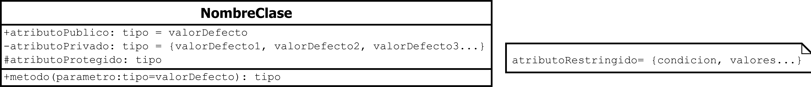

**Contenidos**

- [1. Diagramas UML](#1-diagramas-uml)
    - [1.1. Clases](#11-clases)
        - [1.1.1. Atributos](#111-atributos)
        - [1.1.2. Métodos](#112-métodos)
    - [1.2. Abstract/Interface](#12-abstractinterface)
    - [1.3. Herencia e implementaciones](#13-herencia-e-implementaciones)
    - [1.4. Agrupaciones](#14-agrupaciones)
        - [1.4.1. Cardinalidad](#141-cardinalidad)
        - [1.4.2. Condicionales](#142-condicionales)
        - [1.4.3. Clase extra](#143-clase-extra)
    - [1.5. Resumen](#15-resumen)
- [2. Diagramas de caso de uso](#2-diagramas-de-caso-de-uso)
    - [2.1. Sistema](#21-sistema)
    - [2.2. Caso de uso](#22-caso-de-uso)
    - [2.3. Actor](#23-actor)
    - [2.4. Asociaciones](#24-asociaciones)
        - [2.4.1. Generalización](#241-generalización)

# 1. Diagramas UML

## 1.1. Clases

### 1.1.1. Atributos
Los atributos de una clase pueden ser:

- `+`: Representan atributos **públicos**
- `-`: Representan atributos **privados**
- `#`: Representan atributos **protegidos**

Se puede indicar de que tipo son los atributos, `<+,-,#>atributo: <tipo>`
Se puede indicar un valor o valores por defecto `<+,-,#>atributo: <tipo>= <valor_por_defecto>` o `<+,-,#>atributo: <tipo>= {<valor_por_defecto_1>, <valor_por_defecto_2>, <valor_por_defecto_N>}`

### 1.1.2. Métodos
Los métodos pueden ser igual que los atributos (públicos, privados y protegidos). Para indicar parámetros se utiliza `<+,-,#>metodo(<parametro>: <tipo>= <valor_o_valores_por_defecto>): <tipo_retorno>`

## 1.2. Abstract/Interface
Una clase **abstracta** se declara igual que una clase normal, pero con el nombre en *cursiva*.
Una interfaz se declara igual que una clase normal pero con el indicativo `<<interface>>`.

## 1.3. Herencia e implementaciones

## 1.4. Agrupaciones
Las agrupaciones existentes son:

- **Asociación**: Relación entre objetos donde uno usa o interactúa con otro
- **Agregación**: Relación "**tiene un**" donde un objeto contiene a otros, pero éstos pueden existir independientemente
- **Composición**: Relación "**contiene**" fuerte donde un objeto contiene a otros y éstos no pueden existir sin el contenedor
- **Dependencia**: Similar a la asociación pero una clase no tendría sentido sin la otra

### 1.4.1. Cardinalidad
Describe el número de instancias de una clase que pueden estar asociadas con otra clase:

- `0..1` ó `0,1`: Relación **1** o **ninguno**
- `1..*`: Relación **1** o **muchos**
- `0..*`: Relación **0** o **muchos**
- `n,m,k`: Relación de **N**, **M** ó **K**, pero únicamente esos valores
- `n..m`: Relación de **N** hasta **M**, rango comprendido entre ambos valores

### 1.4.2. Condicionales
Algunas agrupaciones pueden ser condicionales, es decir, pueden agruparse con una u otra clase, pero no con ambas

### 1.4.3. Clase extra
A veces en las relaciones surge una clase de dicha relación

## 1.5. Resumen

# 2. Diagramas de caso de uso

## 2.1. Sistema
Engloba la funcionalidad que ha sido codificada en la aplicación

## 2.2. Caso de uso
Es lo que hace el sistema, su funcionalidad

## 2.3. Actor
Es la persona o rol que usa el sistema (interactúa con uno o varios casos de uso)

## 2.4. Asociaciones

- `Asociación`: Asocia un actor con un caso de uso
- `Inclusión` **include**: Asocia un caso de uso con otro que se ejecuta sin que el actor lo sepa
- `Extensión` **extends**: Asocia un caso de uso con otro caso, pero que el actor debe interactuar con él

### 2.4.1. Generalización
Permite identificar elementos comunes entre distintos conceptos

